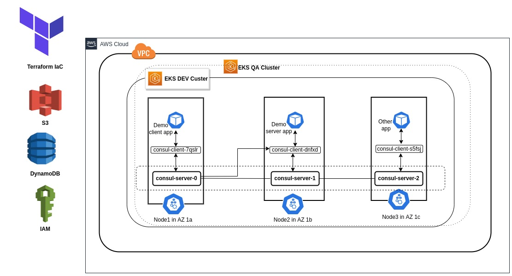
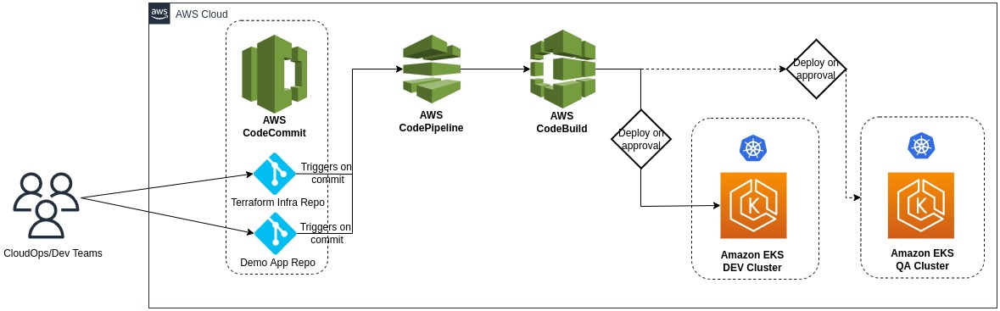

# A POC on Highly Availabe EKS Consul Cluster on AWS

This projects implements a fully automated Highly Available Kubernetes Consul cluster infrastructure distributed over three availability zones.


## Appendix

- [Prerequisites](#prerequisites)
- [Architecture](#architecture)
- [Technologies used](#technologies-used)
- [Kubernetes cluster implementation](#kubernetes-cluster-implementation)
- [Consul service mesh implementation](#consul-service-mesh-implementation)
- [Automated infrastructure deployments](#automated-infrastructure-deployments)
- [Demo application](#demo-application)
- [Maintenance tasks](#maintenance-tasks)
- [Cost estimates](#cost-estimates)
- [References and links](#references-and-links)


## Prerequisites

Below software packages are needed for this project.

Name | Version used | Purpose
----|-----
 aws-cli | 2.7.5 | To run Terraform operations in AWS
 Terraform | 1.2.2  | IaC tool
 kubectl | 1.24.1 | To manage k8s cluster
 helm | 3.9.0 | K8s deployment tool


An AWS account with the necessary IAM permissions needs to be configured in AWS CLI.


## Architecture

A HA Consul cluster in EKS is implmented as shown in the below architecture diagram. Two separate DEV and QA environments can be provisioned in a fully automated manner. 



## Technologies used

Sl. No. | Major Tool/Service used | Purpose 
----|-----
 1 | EKS | For kubernetes cluster
 2 | Consul | Service mesh
 3 | Terraform | IaC
 4 | EC2 | For K8s nodes
 5 | CodeCommit | Version control
 6 | CodePipeline | For CICD build pipeline
 7 | CodeBuild | For build & execution
 8 | VPC & subnets | For networking & isolation
 9 | S3 | Remote statefile storage
 10 | DynamoDB | For locking statefile
 11 | IAM | Autohrization & access control
 12 | Systems Manager | For storing secrets
 13 | CloudWatch | Monitoring & logging


## Kubernetes cluster implementation

Kuberenetes cluster infrastructre in EKS is implemented using Terraform scripts stored under the 'terraform-iac' directory. 


#### Terraform workspace management
Configuration and management of multiple environemnts like DEV and QA are being handled by making use of the Terraform workspace concept as shown below.

Useful commands for managing DEV environment:

```bash
  terraform init
  terraform workspace select dev
  terraform workspace list
  terraform plan -var-file dev.tfvars
  terraform apply -var-file dev.tfvars
  terraform destroy -var-file dev.tfvars  //note this will delete the entire resources created via the apply command
```

Useful commands for managing QA environment:

```bash
  terraform init
  terraform workspace select qa
  terraform workspace list
  terraform plan -var-file qa.tfvars
  terraform apply -var-file qa.tfvars
  terraform destroy -var-file qa.tfvars   //note this will delete the entire resources created via the apply command
```

#### Terraform statefile management
For ensuring shared storage and proper versioning, the state file (terraform.tfstate) is kept remotely in AWS S3 storage using Terraform backend. Along with that DynamoDB locking is enabled to prevent concurrent executions.

## Kubectl configuration

Kubectl needs to be configred in the local client machine for managing the cluster further.

```bash
  terraform workspace select <dev/qa>
  aws eks --region $(terraform output -raw region) update-kubeconfig --name $(terraform output -raw cluster_name) --profile <iam_profile_name>
  kubectl cluster-info
  kubectl get pods -A
```

## Consul service mesh implementation

### What is Consul?
Consul is a multi-networking tool that offers a fully-featured service mesh solution that solves the networking and security challenges of operating microservices and cloud infrastructure. Consul offers a software-driven approach to routing and segmentation. It also brings additional benefits such as failure handling, retries, and network observability.

### Consul deployment
Consul deployment onto a Kubernetes cluster is mainly handled by using HashiCorp’s official Helm chart or by the Consul K8S CLI. Here in this project Consul deployment is handled using the first Helm chart method.

Useful commands for deploying and managing Consul service mesh:

```bash
  helm install consul hashicorp/consul --create-namespace --namespace consul --values helm-consul-values.yaml --version "0.43.0"
  helm list -A
  helm status consul -n consul
  kubectl get pods --namespace consul
  helm uninstall consul -n consul   //note this will delete all the resources created by the above install command
```
Here 'helm install' creates Consul by referring the below values from the 'helm-consul-values.yaml' file.
```javascript
global:
  name: consul
  datacenter: consuldc
connectInject:
  enabled: true
controller:
  enabled: true
ui:
  enabled: true
```


## Automated infrastructure deployments

Below architecture diagram shows flow of the CICD pipeline implemented for this project to deploy both Kubernetes infra and Consul service mesh.




## Demo application

A sample application is made available in the [consul-demo-app](https://git-codecommit.eu-central-1.amazonaws.com/v1/repos/consul-demo-app) repository for describing the use case of Consul service mesh. 
This application deployment is also automated as shown in the above diagram.

Below commands can be used to manage this application deployment manually.
```bash
  terraform init
  terraform workspace select ${workspace}
  aws eks --region $(terraform output -raw region) update-kubeconfig --name $(terraform output -raw cluster_name)
  kubectl cluster-info
  kubectl apply -f specfiles/
  kubectl get pods
```

The service mesh use case can be illustrated after entering into the demo client app pod.
```javascript
kubectl exec -it <name_of_echo_demo_client_app_pod> -- /bin/sh
curl localhost:1234
```

## Maintenance tasks

#### For Consul

Consul UI can be used for diagnosing the service mesh.
Below are the useful commands for accessing the Consul UI locally.

```bash
kubectl get pods --namespace consul
kubectl port-forward consul-server-0 --namespace consul 8500:8500
```
It can be accessed locally using http://localhost:8500/ui/ URL.

#### For Kubernetes
Kubernetes Lens can be used. This is an effective, open-source IDE for Kubernetes. Lens simplifies working with Kubernetes by helping you manage and monitor clusters in real time.
This tool can be installed in the local machine for administering the cluster.

## Cost estimates

Below estimation is based on AWS Frankfurt (eu-central-1) region's pricing.

AWS Service Name | Type | Hourly Cost | Numbers | Monthly Cost
----|-----
EC2(Dev) | t2.small | $0.0268 | 3 | $58.69
EC2(QA) | t2.medium | $0.0536 | 3 | $117.38
EBS | 30GB SSD | - | 6 | $21.42
EKS | - | $0.10 | 2 | $146.00 
Misc. | - | - | - | $25
**Total** | | | | $368.49 ~= **$370**


## References and links

Code repositories are available in below links.


Click to access the [consul-eks-cluster](https://git-codecommit.eu-central-1.amazonaws.com/v1/repos/consul-eks-cluster) repo


Click to access the [consul-demo-app ](https://git-codecommit.eu-central-1.amazonaws.com/v1/repos/consul-demo-app) repo
